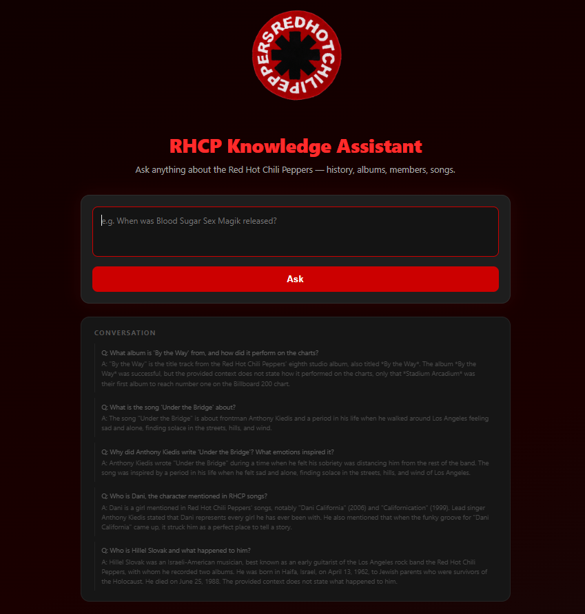

# RHCP Knowledge Assistant — RAG System

A Retrieval-Augmented Generation (RAG) web application for answering questions about the **Red Hot Chili Peppers**, built with Flask, FAISS, Hugging Face embeddings, and Google Gemini.

**Video Demo :**
https://www.youtube.com/watch?v=PckAgAw1dkw
---


## Architecture

```
User Question
      │
      ▼
┌─────────────────────────────────────────────────────────┐
│                     Flask Web App                       │
│                    (RHCP_app.py)                        │
└──────────────────────────┬──────────────────────────────┘
                           │
                           ▼
┌─────────────────────────────────────────────────────────┐
│                    RAG Pipeline                         │
│                  (app/rag_system.py)                    │
│                                                         │
│  1. EMBED QUERY                                         │
│     Hugging Face Inference API                          │
│     Model: ibm-granite/granite-embedding-97m            │
│                                                         │
│  2. RETRIEVE                                            │
│     FAISS IndexFlatIP (cosine similarity)               │
│     Top-K=6 chunks, threshold=0.40                      │
│                                                         │
│  3. GENERATE                                            │
│     Google Gemini 2.5 Flash                             │
│     Grounded strictly on retrieved context              │
└─────────────────────────────────────────────────────────┘
```

### Components

| Component | Technology | Role |
|-----------|-----------|------|
| Web framework | Flask | HTTP server, routing, file upload |
| Chunking | NLTK `sent_tokenize` | Splits documents into sentence-level chunks |
| Embeddings | Hugging Face Inference API (`ibm-granite/granite-embedding-97m-multilingual-r2`) | Converts text to dense vectors |
| Vector store | FAISS (`IndexFlatIP`) | Approximate nearest-neighbor search (cosine similarity) |
| LLM | Google Gemini 2.5 Flash | Generates grounded answers from retrieved context |
| Frontend | HTML / CSS / Vanilla JS | Chat UI with loading states, error handling, source display |

### Indexing Strategy

- Documents are split into sentences using NLTK.
- Each sentence is embedded via the Hugging Face Inference API and stored in a FAISS index.
- File hashes (MD5) are persisted in `indexed_files.json` so that re-runs only embed **new or changed files** — avoiding a full rebuild every time.

### Conversation History

Each session maintains a conversation history in the browser. Every request sends the full prior Q&A turns to Gemini, enabling follow-up questions that reference previous answers (e.g. "What instrument did he play?").

---

## Knowledge Base

The knowledge base was manually collected from two sources:

### Wikipedia
Factual articles about the band and its members — history, discography, lineup changes, and biographical information.

| File | Content |
|------|---------|
| `The RHCP WIK.txt` | Full Wikipedia article on the Red Hot Chili Peppers |
| `Hilelel Slovak - הלל סלובק.txt` | Wikipedia biography of Hillel Slovak (founding guitarist) |

### Genius
Song pages from [genius.com](https://genius.com) — full lyrics alongside crowd-sourced annotations that explain the meaning behind each line, written by music analysts and fans.

| File | Content |
|------|---------|
| `Under the Bridge By Red Hot Chili P.md` | Lyrics + annotations for "Under the Bridge" |
| `Genius-By_The_Way.md` | Lyrics + annotations for "By the Way" |

> **More documents will be added over time** — additional Wikipedia articles (members, albums) and Genius pages (more songs) are planned to expand the system's coverage.

---

## Setup

```bash
# 1. Install dependencies
pip install -r requirements.txt

# 2. Create a .env file with your API keys
GEMINI_API_KEY=your_gemini_key
HF_TOKEN=your_huggingface_token

# 3. Run the app
python RHCP_app.py
```

The index is built automatically on first run. Subsequent runs load the saved FAISS index from `vector_store/`.

---

## Example Queries & Outputs




> Demonstrates that the system does not hallucinate answers outside its knowledge base.


## Reflection

### What Worked Well
- **Incremental indexing** — MD5-based file tracking means re-indexing only processes new documents, keeping startup fast after the first run.
- **Strict grounding** — Gemini is instructed to answer only from retrieved context, which effectively prevents hallucination (demonstrated by the out-of-scope test).
- **Conversation history** — Passing prior turns to the model enables natural follow-up questions within a session.
- **Clean UI** — Loading indicators, error cards, and a sources panel give users clear feedback at every stage.

### What Could Be Improved
- **Batch embeddings** — `BATCH_SIZE=1` means one API call per sentence. Increasing the batch size (e.g. to 16–32) would dramatically speed up the initial indexing.
- **Chunk strategy** — Sentence-level chunking can split context across adjacent sentences. A sliding-window approach with overlap would preserve more context per chunk.
- **Persistent conversation** — History is stored in the browser and lost on refresh. A server-side session store (e.g. Redis) would allow resuming conversations.
- **Larger knowledge base** — The current dataset covers a limited set of documents. Adding more albums, interviews, and tour histories would improve answer breadth.
